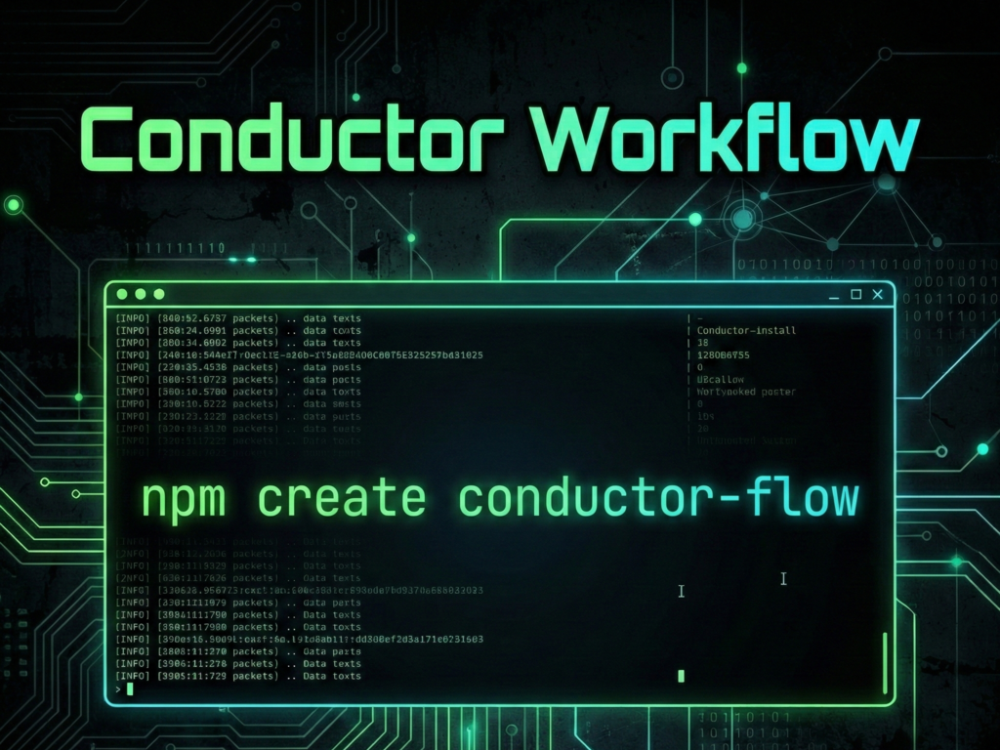

<div align="center">
  <a href="https://github.com/你的用户名/create-conductor-flow">
    
  </a>

  <h1>Conductor Scaffolding CLI</h1>

  <p>
    <a href="https://www.npmjs.com/package/create-conductor-flow">
      
    </a>
    <a href="https://github.com/Jonkimi/create-conductor-flow/blob/main/LICENSE">
      
    </a>
    <a href="https://npmcharts.com/compare/create-conductor-flow?minimal=true">
      
    </a>
  </p>
  <p>
    <strong>English</strong> | <a href="./README_zh.md">简体中文</a> | <a href="./README_ja.md">日本語</a> | <a href="./README_ko.md">한국어</a>
  </p>
  <br>
  <blockquote>
    <strong>The scaffolding tool to generate spec-driven, portable <a href="https://github.com/gemini-cli-extensions/conductor">Gemini Conductor</a> workflows for any AI coding agent.</strong>
  </blockquote>
  <br>
</div>
Get started immediately with:

```bash
npm create conductor-flow
```

---

**Conductor Scaffolding CLI** enables the **[context-first evolution of spec-driven development](https://blog.jonkimi.com/2026/02/01/en/Vibe-Coding-with-context-driven-development-using-Conductor-for-Gemini-CLI/)** by instantly setting up portable workflows compatible with leading AI Coding Assistants, including:
- **Opencode**
- **Claude Code**
- **Antigravity**
- **Cursor**
- **Github Copilot**
- **Codex**
- **Windsurf**
-  **Cline** 
- **Kilo Code**
- **Roo Code**
- **Qwen Code**
- **Factory Droid**
- **Gemini CLI**

Originally developed for the Gemini CLI, the **Conductor** is now decoupled by this project, **empowering developers to maintain context, manage tasks, and orchestrate complex features**. It serves as a bridge between human intent and AI execution, ensuring "Context is King" in the era of Agentic AI.


## ✨ Key Features

-   **Agent-Agnostic Setup:** Provide a mechanism to "install" Conductor commands and templates into a project, effectively "enabling" it for consumption by multiple different coding agents.
-   **Agent-Agnostic Workflows**: Switch between agents without losing project context or progress.
-   **Context Management**: Structured artifacts (`product.md`, `tech-stack.md`, `spec.md`, `plan.md`) keep your AI agent focused and context-aware.
-   **Spec-Driven Development**: Define *what* you want before asking the AI *how* to build it.
-   **Git Ignore Configuration**: Automatically configure `.gitignore` or `.git/info/exclude` to exclude agent configuration files from version control.
-   **Easy Initialization**: Single command setup with `npm create conductor-flow`.

## 🚀 Usage

### Interactive Mode (Recommended)

The easiest way to start is to run the interactive setup. It will guide you through configuring your workflow spec, selecting your AI agent, and settings.

```bash
npm create conductor-flow
```
Or if you prefer the shorthand alias:

```bash
npx conductor-init
```

You will be prompted to select your target environment:

```text
? Select your coding agent:
❯ OpenCode (AGENTS.md, .opencode/commands)
  Claude Code (CLAUDE.md, .claude/commands)
  Antigravity (GEMINI.md, .agent/workflows)
  Cursor (AGENTS.md, .cursor/commands)
  Github Copilot (AGENTS.md, .github/prompts)
  Codex (AGENTS.md, .codex/prompts)
  Windsurf (AGENTS.md, .windsurf/workflows)
? Select installation method:
❯ Project (Current Directory)
? Configure git ignore for Conductor files?
  Add to .gitignore
  Add to .git/info/exclude
  Remove existing entries
❯ Don't configure git ignore
? Select template source:
❯ Bundled Templates (Offline) - Use built-in templates, no network required
  Official Repository (Latest) - Fetch latest from official repository
  Custom Repository - Specify your own repository and branch
```

### Template Source Options

The CLI provides three template sources to choose from:

| Option | Description | Best For |
|--------|-------------|----------|
| **Bundled Templates** | Use built-in templates that are packaged with the CLI. No network required. | Offline usage, quick setup, stable templates |
| **Official Repository** | Download the latest templates from the [official Conductor repository](https://github.com/gemini-cli-extensions/conductor). | Getting the latest features and updates |
| **Custom Repository** | Specify your own Git repository and branch for templates. | Custom workflows, enterprise templates |

**Non-Interactive Mode (CI/CD)**

In CI/CD environments or when stdin is not a TTY, the CLI automatically uses bundled templates without prompting:
- When `CI=true` environment variable is set
- When running in a non-interactive shell (piped input)

### Arguments & Flags

For power users, you can pass arguments directly to skip prompts:

```bash
npm create conductor-flow -a claude-code

# Use official repository explicitly
npm create conductor-flow --repo

# Specify a custom template repository and branch
npm create conductor-flow --repo https://github.com/your-org/custom-conductor --branch v2
```

### Common Options

```text
npm create conductor-flow [path] [options]

Positionals:
  path  Directory to install Conductor                                                                                                                                                               [string] [default: "."]

Options:
  -a, --agent       Specify the coding agent
                                     [string] [choices: "opencode", "claude-code", "antigravity", "cursor", "github-copilot", "codex", "windsurf", "cline", "kilo-code", "roo-code", "qwen-code", "factory-droid", "gemini"]
  -r, --repo        Git repository URL for templates. Without this flag, interactive template source selection is shown.                                                                                            [string]
  -b, --branch      Branch name for template repository                                                                                                                                           [string] [default: "main"]
  -s, --scope       Installation scope (project or global)                                                                                                                           [string] [choices: "project", "global"]
  -g, --git-ignore  Configure git ignore for Conductor files (gitignore: add to .gitignore, exclude: add to .git/info/exclude, none: remove entries)                      [string] [choices: "gitignore", "exclude", "none"]
  -f, --force       Force overwrite existing installation                                                                                                                                         [boolean] [default: false]
      --reset       Clear saved preferences and show all prompts                                                                                                                                  [boolean] [default: false]
  -h, --help        Show help                                                                                                                                                                                      [boolean]
  -v, --version     Show version number                                                                                                                                                                            [boolean]

Examples:
  npm create conductor-flow                                           Install with interactive prompts (template source selection)
  npm create conductor-flow --agent claude-code                       Install for Claude Code agent
  npm create conductor-flow --repo https://github.com/user/templates  Use custom template repository
  npm create conductor-flow --git-ignore gitignore                    Add Conductor files to .gitignore
  npm create conductor-flow --git-ignore exclude                      Add Conductor files to .git/info/exclude
  npm create conductor-flow --git-ignore none                         Remove Conductor entries from git ignore
  npm create conductor-flow --reset                                   Clear saved preferences and show all prompts
```


### Configuration Persistence

The CLI remembers your preferences between runs, so you don't have to specify the same options every time.

**What's Saved:**
- Agent selection (`--agent`)
- Template source (`--repo`, `--branch`)
- Git ignore preference (`--git-ignore`)

**How It Works:**
1. On first run, select your preferences interactively or via flags
2. On subsequent runs, saved preferences are automatically applied
3. CLI flags always override saved preferences

**Example:**

```bash
# First run - specify your preferences
npm create conductor-flow --agent claude-code --git-ignore exclude

# Future runs - automatically uses claude-code and exclude
npm create conductor-flow
# Output: [Config] Using saved agent: claude-code
# Output: [Config] Using saved git-ignore: exclude
```

**Reset Preferences:**

To clear saved preferences and start fresh with all prompts:

```bash
npm create conductor-flow --reset
```

**Configuration Location:**

Preferences are stored following the XDG Base Directory Specification:
- **macOS**: `~/Library/Application Support/create-conductor-flow/config.json`
- **Linux**: `~/.config/create-conductor-flow/config.json`
- **Windows**: `%APPDATA%\create-conductor-flow\config.json`

### 3. Shell Completion for Global Installation(Advanced Setup)


Enable tab completion for specific shells (Bash, Zsh) to make using `conductor-init` easier.

#### Global Installation

```bash
npm install -g create-conductor-flow
```

Or, if you prefer the shorthand alias:

```bash
npm install -g conductor-init
```

After installation, you can use the `conductor-init completion` command to generate the completion script.

#### Zsh (Recommended)

**Option 1: Source from file (Best for performance)**

Generate the script to a file and source it in your `.zshrc`:

```zsh
mkdir -p ~/.config/conductor
conductor-init completion > ~/.config/conductor/completion.zsh
echo 'source ~/.config/conductor/completion.zsh' >> ~/.zshrc
source ~/.zshrc
```

**Option 2: One-liner**

Add this directly to your `.zshrc` (easiest setup):

```zsh
echo 'source <(conductor-init completion)' >> ~/.zshrc
source ~/.zshrc
```

#### Bash

Add the completion script to your `.bashrc`:

```bash
conductor-init completion >> ~/.bashrc
source ~/.bashrc
```

### 4. Using Conductor with Your Agent

Once installed, you can instruct your AI Agent to perform Conductor tasks using the installed commands. For example:

-   `/conductor-setup` - Initialize the project structure.
-   `/conductor-newTrack` - Start a new feature or bug fix track.
-   `/conductor-implement` - Implement the selected track.
-   `/conductor-review` - Review the completed track work against guidelines and the plan.
-   `/conductor-revert` - Revert previous work.
-   `/conductor-status` - Check the status of current tracks.

*Note: The exact invocation syntax depends on your specific agent's slash command or file context capabilities.*


## 🙏 Acknowledgements

This project is inspired by and based on the [Conductor](https://github.com/gemini-cli-extensions/conductor) and [Conductor-for-all](https://github.com/hlhr202/Conductor-for-all).
