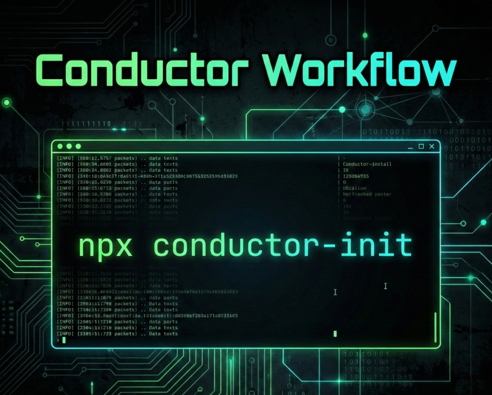

# Conductor Init

[](https://badge.fury.io/js/conductor-init)



[English](./README.md) | [中文](./README_zh.md) | [日本語](./README_ja.md) | [한국어](./README_ko.md)

**Conductor Init**은 `npx`를 통해 **모든** AI 코딩 에이전트를 위한 사양 주도형(spec-driven) 휴대용 **Gemini [Conductor](https://github.com/gemini-cli-extensions/conductor)** 워크플로우를 생성하는 **Conductor 스캐폴딩 CLI**입니다. 이는 **Claude Code**, **OpenCode**, **Cursor**, **Kilo Code** 및 기타 주요 AI 코딩 도우미를 위한 **[컨텍스트 우선의 사양 주도형 개발의 진화](https://blog.jonkimi.com/2026/02/01/en/Vibe-Coding-with-context-driven-development-using-Conductor-for-Gemini-CLI/)**를 가능하게 합니다.

원래 Gemini CLI를 위해 개발된 **Conductor**는 이 프로젝트를 통해 분리되어 **개발자가 컨텍스트를 유지하고, 작업을 관리하며, 복잡한 기능을 조율할 수 있도록 지원합니다**. 이는 인간의 의도와 AI 실행 사이의 가교 역할을 하며, Agentic AI 시대에 "Context is King(컨텍스트가 왕)"임을 보장합니다.

## 🎯 목표

-   **범용 호환성:** Gemini CLI 생태계 외부에서 Conductor 방법론을 활성화합니다.
-   **에이전트 불가지론적 설정:** 프로젝트에 Conductor 명령과 템플릿을 "설치"하는 메커니즘을 제공하여 여러 다른 코딩 에이전트가 사용할 수 있도록 "활성화"합니다.
-   **표준화:** 인간의 의도와 AI 실행 사이의 격차를 좁히는 프로젝트 오케스트레이션을 위한 통합 인터페이스를 만듭니다.


## ✨ 주요 기능

-   **범용 AI 호환성**: **Opencode**, **Claude Code**, **Antigravity**, **Cursor**, **VS Code Copilot**, **Codex**, **Windsurf**, **Cline**, **Kilo Code**, **Roo Code**, **Qwen Code**, **Factory Droid** 및 **Gemini CLI**와 즉시 연동됩니다.
-   **컨텍스트 관리**: 구조화된 아티팩트(`spec.md`, `plan.md`)는 AI 에이전트가 집중하고 컨텍스트를 인식하도록 유지합니다.
-   **사양 기반 개발**: AI에게 *어떻게* 구축할지 묻기 전에 *무엇을* 원하는지 정의하십시오.
-   **에이전트 불가지론적 워크플로우**: 프로젝트 컨텍스트나 진행 상황을 잃지 않고 에이전트 간에 전환할 수 있습니다.
-   **간편한 초기화**: `npx conductor-init` 명령 하나로 설정할 수 있습니다.
-   **Git 무시 설정**: 에이전트 설정 파일을 버전 관리에서 제외하도록 `.gitignore` 또는 `.git/info/exclude`를 자동으로 구성합니다.

## 🚀 사용법

### 1. 프로젝트에서 Conductor 설정

```text
conductor-init [path] [options]

Positionals:
  path  Directory to install Conductor                   [string] [default: "."]

Options:
  -a, --agent       Specify the coding agent
          [string] [choices: "opencode", "claude-code", "antigravity", "cursor",
        "vscode-copilot", "codex", "windsurf", "cline", "kilo-code", "roo-code",
                                         "qwen-code", "factory-droid", "gemini"]
  -r, --repo        Git repository URL for conductor. If used without value,
                    defaults to official repository.                    [string]
  -b, --branch      Branch name for conductor repository
                                                      [string] [default: "main"]
  -s, --scope       Installation scope (project or global)
                                         [string] [choices: "project", "global"]
  -g, --git-ignore  Configure git ignore for Conductor files (gitignore: add to
                    .gitignore, exclude: add to .git/info/exclude, none: remove
                    entries)  [string] [choices: "gitignore", "exclude", "none"]
  -f, --force       Force overwrite existing installation
                                                      [boolean] [default: false]
  -h, --help        Show help                                          [boolean]
  -v, --version     Show version number                                [boolean]

Examples:
  conductor-init                         Install with interactive prompts
  conductor-init --agent claude-code     Install for Claude Code agent
  conductor-init --git-ignore gitignore  Add Conductor files to .gitignore
  conductor-init --git-ignore exclude    Add Conductor files to
                                         .git/info/exclude
  conductor-init --git-ignore none       Remove Conductor entries from git
                                         ignore
```

프로젝트에서 Conductor를 초기화하려면 프로젝트 루트에서 다음 명령을 실행하기만 하면 됩니다:

```bash
npx conductor-init
```

### 2. 대안: 소스에서 빌드

소스에서 빌드하려는 경우:

```bash
pnpm install
pnpm build
node dist/index.js install
```

AI 코딩 에이전트를 선택하라는 메시지가 표시됩니다:
-   **Opencode**
-   **Claude Code**
-   **Antigravity**
-   **Cursor**
-   **VS Code Copilot**
-   **Codex**
-   **Windsurf**
-   **Cline**
-   **Kilo Code**
-   **Roo Code**
-   **Qwen Code**
-   **Factory Droid**
-   **Gemini CLI**

이 작업은 환경을 확인하고 필요한 Conductor 파일을 설치합니다:
-   **Commands:** 에이전트가 실행할 수 있는 에이전트별 프롬프트 또는 명령 파일 (예: `.opencode/commands/conductor:setup.md` 또는 `.gemini/commands/conductor:setup.toml`).
-   **Templates:** 워크플로우 가이드 및 스타일 가이드 (예: `.opencode/conductor/templates/`).

-   **Templates:** 워크플로우 가이드 및 스타일 가이드 (예: `.opencode/conductor/templates/`).

### 3. 셸 자동 완성 (Shell Completion)

특정 셸(Bash, Zsh)에 대한 탭 자동 완성을 활성화하여 `conductor-init`을(를) 더 쉽게 사용할 수 있습니다.

#### Zsh (권장)

**옵션 1: 파일에서 소싱 (성능 최적)**

스크립트를 파일로 생성하고 `.zshrc`에서 소싱합니다:

```zsh
mkdir -p ~/.config/conductor
conductor-init completion > ~/.config/conductor/completion.zsh
echo 'source ~/.config/conductor/completion.zsh' >> ~/.zshrc
source ~/.zshrc
```

**옵션 2: 한 줄 명령 (One-liner)**

`.zshrc`에 직접 추가합니다 (가장 쉬운 설정):

```zsh
echo 'source <(conductor-init completion)' >> ~/.zshrc
source ~/.zshrc
```

#### Bash

완성 스크립트를 `.bashrc`에 추가합니다:

```bash
conductor-init completion >> ~/.bashrc
source ~/.bashrc
```

### 4. 에이전트와 함께 Conductor 사용

설치가 완료되면 설치된 명령을 사용하여 AI 에이전트에게 Conductor 작업을 수행하도록 지시할 수 있습니다. 예를 들어:

-   `/conductor-setup` - 프로젝트 구조를 초기화합니다.
-   `/conductor-newTrack` - 새로운 기능 또는 버그 수정 트랙을 시작합니다.
-   `/conductor-implement` - 선택한 트랙을 구현합니다.
-   `/conductor-review` - 지침 및 계획에 대해 완료된 트랙 작업을 검토합니다.
-   `/conductor-revert` - 이전 작업을 되돌립니다.
-   `/conductor-status` - 현재 트랙의 상태를 확인합니다.

*참고: 정확한 호출 구문은 특정 에이전트의 슬래시 명령 또는 파일 컨텍스트 기능에 따라 다릅니다.*


## 🙏 감사의 말

이 프로젝트는 [Conductor](https://github.com/gemini-cli-extensions/conductor) 및 [Conductor-for-all](https://github.com/hlhr202/Conductor-for-all)에서 영감을 받아 그 위에 구축되었습니다。
