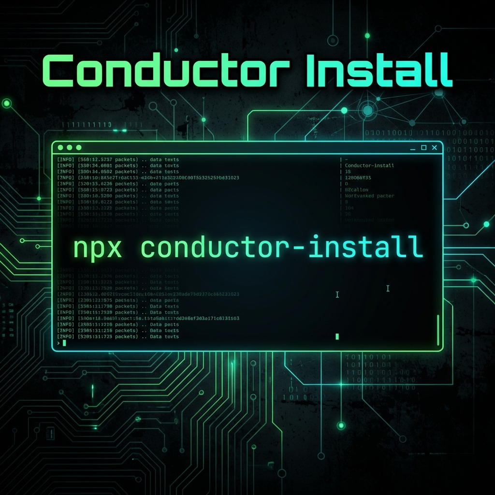

# Conductor Install

[](https://badge.fury.io/js/conductor-install)



[English](./README.md) | [中文](./README_zh.md) | [日本語](./README_ja.md) | [한국어](./README_ko.md)

**Conductor Install** 是一个通用的命令行工具，它将 **Gemini CLI 扩展 [Conductor](https://github.com/gemini-cli-extensions/conductor)** 引入 **任何** AI 编码代理环境。它为 **Claude Code**、**OpenCode**、**Cursor**、**Kilo Code** 以及其他主流 AI 编码助手启用了**[首选上下文进化的规范驱动开发](https://blog.jonkimi.com/2026/02/01/Vibe-Coding-with-context-driven-development-using-Conductor-for-Gemini-CLI/)**（context-first evolution of spec-driven development）。

**Conductor** 最初是为 Gemini CLI 开发的，现在由本项目将其解耦，**使开发人员能够维护上下文、管理任务并编排复杂功能**。它充当人类意图与 AI 执行之间的桥梁，确保在 Agentic AI 时代"上下文为王"。

## 🎯 目标

-   **通用兼容性：** 在 Gemini CLI 生态系统之外启用 Conductor 方法论。
-   **代理无关的设置：** 提供一种机制来将 Conductor 命令和模板“安装”到项目中，有效地“启用”它以供多种不同的编码代理使用。
-   **标准化：** 创建一个统一的项目编排接口，弥合人类意图与 AI 执行之间的差距。


## ✨ 主要特性

-   **通用 AI 兼容性**: 开箱即用，支持 **Opencode**、**Claude Code**、**Antigravity**、**Cursor**、**VS Code Copilot**、**Codex**、**Windsurf**、**Cline**、**Kilo Code**、**Roo Code**、**Qwen Code**、**Factory Droid** 以及 **Gemini CLI**。
-   **上下文管理**: 结构化的工件（`spec.md`、`plan.md`）让您的 AI 代理保持专注并具备上下文感知能力。
-   **规范驱动开发**: 在询问 AI *如何*构建之前，先定义您*想要什么*。
-   **代理无关的工作流**: 在不丢失项目上下文或进度的情况下切换代理。
-   **轻松初始化**: 使用 `npx conductor-install` 即可完成设置。

## 🚀 使用方法

### 1. 在你的项目中设置 Conductor

```text
conductor-install [path] [options]

Positionals:
  path  Directory to install Conductor                   [string] [default: "."]

Options:
  -a, --agent    Specify the coding agent
          [string] [choices: "opencode", "claude-code", "antigravity", "cursor",
        "vscode-copilot", "codex", "windsurf", "cline", "kilo-code", "roo-code",
                                                          "qwen-code", "gemini"]
  -r, --repo     Git repository URL for conductor. If used without value,
                 defaults to official repository.                       [string]
  -b, --branch   Branch name for conductor repository [string] [default: "main"]
  -s, --scope    Installation scope (project or global)
                                         [string] [choices: "project", "global"]
  -f, --force    Force overwrite existing installation[boolean] [default: false]
  -h, --help     Show help                                             [boolean]
  -v, --version  Show version number                                   [boolean]
```

要在你的项目中初始化 Conductor，只需在项目根目录下运行以下命令：

```bash
npx conductor-install
```

你也可以指定自定义模板仓库和分支：

```bash
npx conductor-install --repo https://github.com/your-org/custom-conductor --branch v2
```

### 2. 或者：从源码构建

如果你更喜欢从源码构建：

```bash
pnpm install
pnpm build
node dist/index.js install
```

你将被提示选择你的 AI 编码代理：
-   **Opencode**
-   **Claude Code**
-   **Antigravity**
-   **Cursor**
-   **VS Code Copilot**
-   **Codex**
-   **Windsurf**
-   **Cline**
-   **Kilo Code**
-   **Roo Code**
-   **Qwen Code**
-   **Factory Droid**
-   **Gemini CLI**

这将验证环境并安装必要的 Conductor 文件：
-   **Commands:** 代理特定的提示或命令文件（例如 `.opencode/commands/conductor:setup.md` 或 `.gemini/commands/conductor:setup.toml`），你的代理可以执行这些文件。
-   **Templates:** 工作流指南和风格指南（例如 `.opencode/conductor/templates/`）。

### 3. 与你的代理一起使用 Conductor

安装完成后，你可以指示你的 AI 代理使用安装的命令执行 Conductor 任务。例如：

-   `/conductor:setup` - 初始化项目结构。
-   `/conductor:newTrack` - 开始一个新的功能或错误修复轨道。
-   `/conductor:implement` - 实现选定的轨道。
-   `/conductor:review` - 根据指南和计划审查已完成的轨道工作。
-   `/conductor:revert` - 恢复以前的工作。
-   `/conductor:status` - 检查当前轨道的状态。

*注意：确切的调用语法取决于你的特定代理的斜杠命令或文件上下文功能。*


## 🙏 致谢

本项目受到最初为 **Gemini CLI** 开发的 [Conductor](https://github.com/gemini-cli-extensions/conductor) 方法论的启发并基于此构建。我们旨在将其优势扩展到更广泛的开发者生态系统。
